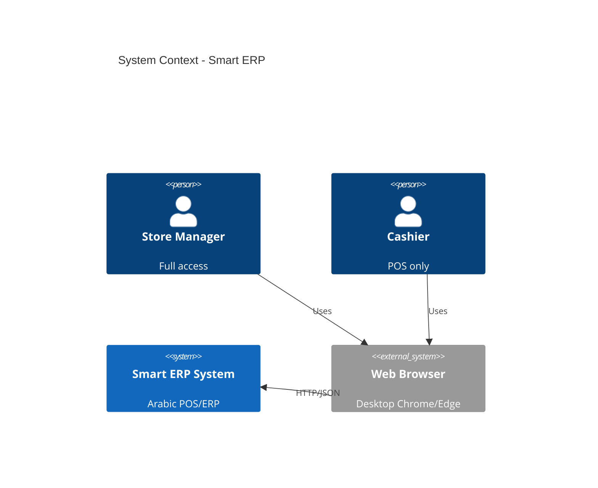
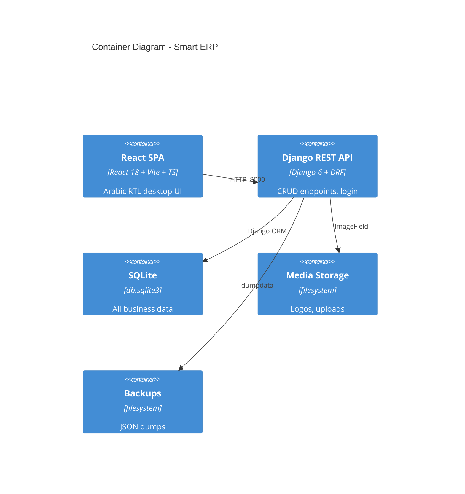
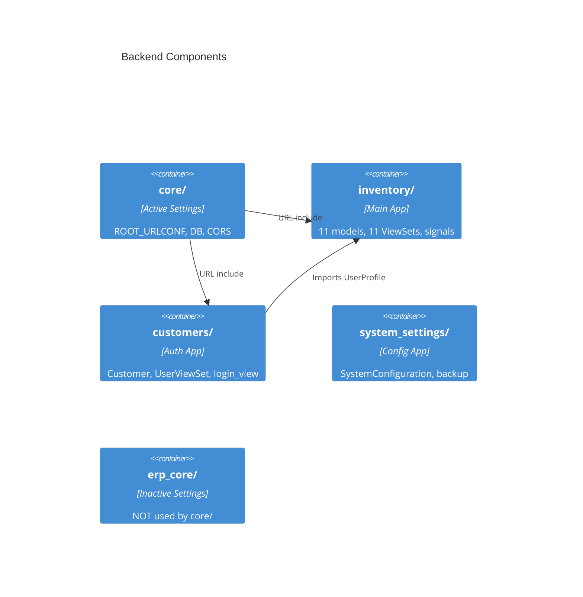
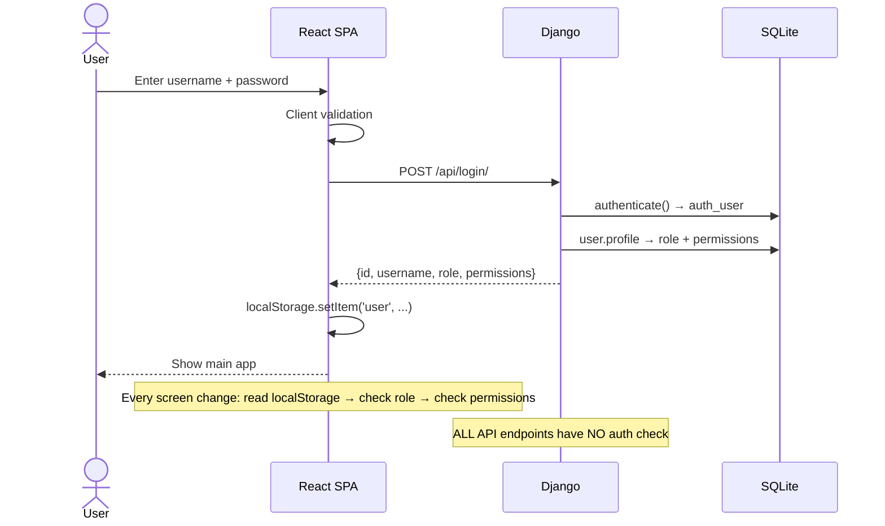
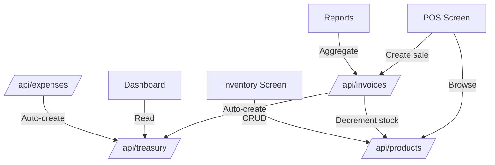
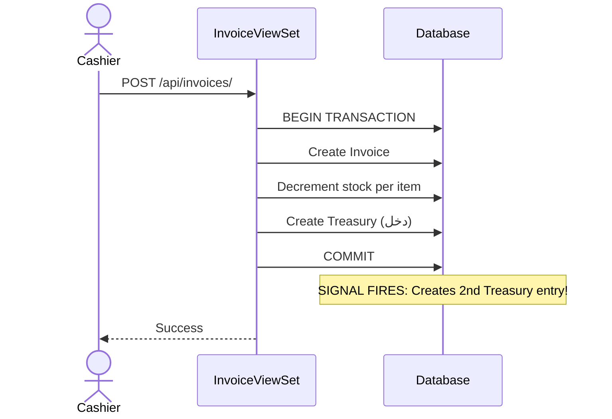

# PROJECT_DEEP_ANALYSIS.md

> **Generated:** 2026-04-18 | **Codebase:** Smart-ERP-System (Go Easy Store)

---

## 1. 🎯 Project Identity

- **Full Name:** Smart-ERP-System — "Intelligent ERP System Enhanced with Anomaly Detection and Voice Interaction"
- **Core Problem:** Complete Arabic-language POS/ERP for small-to-medium retail businesses. Handles sales, inventory, employees, treasury, installments, suppliers, and reporting.
- **End Users:**
  - **مدير (Manager):** Full access — dashboard, reports, user management, settings
  - **كاشير (Cashier):** Restricted — POS screen, basic sales only
  - **محاسب / أمين مخزن:** UI options exist but no backend enforcement
- **Business Rules:**
  1. Sales → Invoice created → Stock decremented → Treasury income
  2. Purchases → Treasury expense deducted
  3. Expenses → Treasury auto-deducted
  4. Installments → Credit tracking with remaining balance
  5. Work Shifts → Cash reconciliation with discrepancy flagging
  6. Net Salary = baseSalary + incentives - advances
  7. Every financial move must create a Treasury Ledger Entry
- **Success =** Cashier processes sales fast; Manager sees real-time dashboards; Installments auto-tracked; Stock alerts fire; RBAC prevents unauthorized access

---

## 2. 🏗️ System Architecture

### 2.1 Architecture Style
**Hybrid Monolith** — Django REST Framework backend (port 8000) serves JSON API to React SPA frontend (Vite, port 5173). Same repo, separate processes.

### 2.2 C4 Level 1 — System Context


### 2.3 C4 Level 2 — Container Diagram


### 2.4 C4 Level 3 — Component Diagram (Backend)


### 2.5 Technology Stack

| Layer | Technology | Version | Why Used |
|-------|-----------|---------|----------|
| Frontend | React | 18.3.1 | Component UI |
| Build | Vite | 6.3.5 | Fast HMR |
| Language | TypeScript | via Vite | Type safety |
| CSS | TailwindCSS | 4.1.12 | Utility-first |
| UI Kit | shadcn/ui + Radix | 48 components | Accessible primitives |
| Icons | Lucide React | ^0.487.0 | Consistent icons |
| Charts | Recharts | ^2.15.2 | React charting |
| PDF | jsPDF + autotable | ^4.2.0/^5.0.7 | Invoice PDF export |
| Excel | xlsx | ^0.18.5 | Spreadsheet export |
| HTTP | Axios | ^1.13.5 | API calls |
| Backend | Django | 6.0.2 | Rapid API + ORM |
| API | DRF | installed | ViewSet CRUD |
| Auth | Django auth | 6.0.2 | Session-based |
| CORS | django-cors-headers | installed | Cross-origin |
| DB | SQLite | 3.x | Zero-config dev |
| Images | Pillow | implied | Logo upload |
| Testing | None | N/A | No tests exist |

---

## 3. 📁 Monorepo Structure — Full Map

```
Smart-ERP-System/
├── .git/                          # Git repo (empty history)
├── .gitignore
├── .venv/                         # Python virtual env
├── .windsurf/rules/               # AI assistant rules
├── ATTRIBUTIONS.md
├── README.md                      # HAS MERGE CONFLICTS
├── guidelines/
├── index.html                     # Vite HTML entry
├── package.json                   # Frontend deps
├── postcss.config.mjs
├── vite.config.ts                 # Vite config + @ alias
│
├── src/                           # FRONTEND
│   ├── main.tsx                   # Entry: renders <App />
│   ├── vite-env.d.ts
│   ├── styles/index.css           # TailwindCSS
│   ├── assets/                    # logo.jpeg, side.png
│   ├── api/
│   │   ├── axiosConfig.ts         # Axios baseURL: http://127.0.0.1:8000/api/
│   │   └── inventoryApi.ts        # getProducts, createProduct, getCustomers, getUsers, createUser, updateUser
│   └── app/
│       ├── App.tsx                # ROOT: routing, auth gate, permissions, cart
│       └── components/
│           ├── AICenter.tsx       # Anomaly detection (mock data)
│           ├── AddCustomerModal.tsx
│           ├── AutomationEngine.tsx # Workflows (mock data)
│           ├── Cart.tsx           # Shopping cart + checkout
│           ├── CashPermissionModal.tsx
│           ├── Dashboard.tsx      # KPIs, quick actions, voice search
│           ├── EmployeeExpenseManagement.tsx
│           ├── InstallmentsManagement.tsx
│           ├── InventoryAuditModal.tsx
│           ├── InventoryScreen.tsx
│           ├── LoginScreen.tsx    # Login + forgot password
│           ├── PriceQuotationModal.tsx
│           ├── ProductGrid.tsx    # Product browsing
│           ├── ProductModal.tsx
│           ├── PurchaseInvoiceModal.tsx
│           ├── QuotationsScreen.tsx
│           ├── ReportsScreen.tsx  # Charts + reports
│           ├── SalesInvoiceModal.tsx
│           ├── SalesRepresentatives.tsx
│           ├── ShiftClosingModal.tsx
│           ├── Sidebar.tsx        # Nav with RBAC
│           ├── SignUpScreen.tsx   # Registration
│           ├── SystemSettings.tsx # Modules, company info, backup
│           ├── UserManagement.tsx # RBAC admin
│           ├── figma/
│           └── ui/                # 48 shadcn/ui primitives
│
└── smart_erp_backend/             # BACKEND
    ├── manage.py
    ├── db.sqlite3                 # IN REPO (security risk)
    ├── fix_user.py
    ├── core/                      # ACTIVE Django project
    │   ├── settings.py            # SQLite, CORS_ALLOW_ALL, SECRET_KEY exposed
    │   ├── urls.py                # /admin/, /api/login/, /api/ (router)
    │   ├── asgi.py / wsgi.py
    ├── erp_core/                  # INACTIVE project (conflicting)
    │   ├── settings.py            # Only system_settings registered
    │   ├── urls.py                # Only /api/system-config/
    ├── inventory/                 # Main app — 11 models
    │   ├── models.py              # Product, StockMovement, Customer, WorkShift, Invoice, Installment, Supplier, Purchase, Expense, Treasury, Employee, UserProfile
    │   ├── views.py               # ViewSets; InvoiceViewSet custom create; ExpenseViewSet auto-treasury
    │   ├── serializers.py         # 11 serializers
    │   ├── signals.py             # Treasury auto-update (CONFLICTS with ViewSet)
    │   ├── admin.py               # All models registered
    │   ├── urls.py                # 11 router registrations
    │   ├── tests.py               # EMPTY
    │   └── migrations/            # 5 migrations
    ├── customers/                 # Auth + customer app
    │   ├── models.py              # Customer (richer than inventory.Customer)
    │   ├── views.py               # CustomerViewSet, UserViewSet, login_view
    │   ├── serializers.py         # CustomerSerializer, UserProfileSerializer, UserSerializer
    │   ├── urls.py                # customers, users, login/
    │   └── migrations/            # 5 migrations
    ├── system_settings/           # Config app
    │   ├── models.py              # SystemConfiguration
    │   ├── views.py               # SystemConfigViewSet + backup_server action
    │   └── migrations/            # 5 migrations
    ├── media/system_logos/
    ├── system_logos/
    └── backups/                   # 29 backup JSON files
```

| Folder | Responsibility | Depends On | Breaks If Removed |
|--------|---------------|------------|-------------------|
| `src/` | Entire frontend | Backend API | No UI |
| `src/api/` | HTTP client | axios, backend | No backend communication |
| `src/app/components/` | All screens | App.tsx, ui/ | All screens gone |
| `src/app/components/ui/` | UI primitives | Radix, CVA | All styled components break |
| `core/` | Active Django config | All apps | Backend won't start |
| `inventory/` | Core business models | core/, auth | All POS/inventory/treasury lost |
| `customers/` | User + customer mgmt | inventory (UserProfile) | Login, user CRUD lost |
| `system_settings/` | System config | core/ | Settings, backup lost |
| `erp_core/` | Inactive alt config | system_settings only | Confusion only |

---

## 4. 🔐 Authentication & Authorization System

### 4.1 Auth Strategy
- **Method:** Django session-based auth (default `django.contrib.auth`)
- **Token Generation:** None. No JWT, no tokens. Login returns plain JSON.
- **Token Storage:** `localStorage.setItem('user', JSON.stringify({id, username, role, permissions}))`
- **Token Validation:** **NONE.** No server-side session validation on API calls. Frontend checks `localStorage` to determine "logged in" state.
- **Token Lifecycle:** No expiry, no refresh, no logout endpoint. Persists until localStorage cleared.

### 4.2 RBAC — Full Deep Dive

**Roles defined in backend (`inventory/models.py` UserProfile.ROLE_CHOICES):**

| Role Key | Arabic Label |
|----------|-------------|
| `مدير` | مدير النظام |
| `كاشير` | كاشير |

**Additional roles in UI only (UserManagement.tsx dropdown):**
- `محاسب` (Accountant)
- `أمين مخزن` (Storekeeper)

**Permission structure (defined in frontend `UserManagement.tsx`):**

| Category | Permission IDs |
|----------|---------------|
| general | `view_home`, `settings` |
| sales | `view_pos`, `add_invoice`, `quotations`, `returns` |
| inventory | `view_stock`, `add_product`, `inventory_count`, `manage_suppliers` |
| finance | `installments`, `representatives` |
| hr | `employees`, `users` |
| advanced | `ai`, `automation` |
| reports | `dashboard_charts`, `daily_summary`, `view_reports` |

**Permissions Matrix:**

| Permission | مدير | كاشير | محاسب | أمين مخزن |
|-----------|:----:|:-----:|:-----:|:--------:|
| view_home | ✅ always | ❌ unless granted | ❌ | ❌ |
| settings | ✅ always | ❌ | ❌ | ❌ |
| view_pos | ✅ always | ✅ if granted | ❌ | ❌ |
| add_invoice | ✅ always | ❌ unless granted | ❌ | ❌ |
| quotations | ✅ always | ❌ unless granted | ❌ | ❌ |
| returns | ✅ always | ❌ unless granted | ❌ | ❌ |
| view_stock | ✅ always | ❌ unless granted | ❌ | ❌ |
| add_product | ✅ always | ❌ unless granted | ❌ | ❌ |
| inventory_count | ✅ always | ❌ unless granted | ❌ | ❌ |
| manage_suppliers | ✅ always | ❌ unless granted | ❌ | ❌ |
| installments | ✅ always | ❌ unless granted | ❌ | ❌ |
| representatives | ✅ always | ❌ unless granted | ❌ | ❌ |
| employees | ✅ always | ❌ unless granted | ❌ | ❌ |
| users | ✅ always | ❌ unless granted | ❌ | ❌ |
| ai | ✅ always | ❌ unless granted | ❌ | ❌ |
| automation | ✅ always | ❌ unless granted | ❌ | ❌ |
| dashboard_charts | ✅ always | ❌ unless granted | ❌ | ❌ |
| daily_summary | ✅ always | ❌ unless granted | ❌ | ❌ |
| view_reports | ✅ always | ❌ unless granted | ❌ | ❌ |

**Manager bypass:** `if (user.role === 'مدير' || user.role === 'مدير_نظام' || user.role === 'ADMIN') return true;`

**No role hierarchy exists.** Flat two-role model: Manager (full) vs. everyone else (permission-based).

### 4.3 Auth Flow — Sequence Diagram


### 4.4 Authorization Guard Logic

| Location | File:Line | Function | Check |
|----------|-----------|----------|-------|
| Screen access | `App.tsx:384-409` | `hasPermission(screen)` | Maps screen→permission IDs, searches all arrays |
| Sidebar visibility | `Sidebar.tsx:284-303` | `canAccess(screen)` | Same mapping, shows/hides icons |
| Sidebar click | `Sidebar.tsx:305-312` | `handleItemClick()` | Alert if no permission |
| Unauthorized | `App.tsx:461-464` | Inline JSX | Shows 🚫 message |

**Backend guards: NONE.** All ViewSets use default `AllowAny`. `login_view` explicitly `@permission_classes([AllowAny])`.

### 4.5 Known RBAC Risks

| ID | Risk | Severity |
|----|------|----------|
| RBAC-1 | No server-side auth — all API endpoints publicly accessible | CRITICAL |
| RBAC-2 | localStorage can be edited to escalate privileges | HIGH |
| RBAC-3 | Backend 2 roles vs UI 4 roles — no permission templates for محاسب/أمين مخزن | MEDIUM |
| RBAC-4 | Dead code: `ADMIN`/`مدير_نظام` checks never match backend-created roles | LOW |
| RBAC-5 | POS screen bypasses `hasPermission()` entirely | MEDIUM |
| RBAC-6 | No logout endpoint or session invalidation | MEDIUM |
| RBAC-7 | Sidebar shows all items (opacity-40) revealing full menu structure | LOW |

---

## 5. 🗄️ Data Architecture

### 5.1 Database Overview
- **Type:** SQLite 3.x (`smart_erp_backend/db.sqlite3`)
- **ORM:** Django ORM (Django 6.0.2)
- **Connection:** Single file, no pooling
- **PostgreSQL:** Commented out in `core/settings.py:88-97`

### 5.2 Full Schema

**inventory_product:**
| Column | Type | Constraints |
|--------|------|-------------|
| id | Integer | PK auto |
| sku | VARCHAR(100) | UNIQUE NOT NULL |
| name | VARCHAR(255) | NOT NULL |
| unit | VARCHAR(50) | DEFAULT 'قطعة' |
| cost_price | DECIMAL(10,2) | NOT NULL |
| retail_price | DECIMAL(10,2) | NOT NULL |
| wholesale_price | DECIMAL(10,2) | NULLABLE |
| current_stock | DECIMAL(10,2) | DEFAULT 0 |
| min_stock_level | DECIMAL(10,2) | DEFAULT 5 |
| expiry_date | DATE | NULLABLE |
| created_at | DATETIME | auto_now_add |

**inventory_stockmovement:**
| Column | Type | Constraints |
|--------|------|-------------|
| id | Integer | PK auto |
| product_id | Integer | FK→Product CASCADE |
| type | VARCHAR(10) | SALE/PURCHASE/ADJUST |
| quantity | DECIMAL(10,2) | NOT NULL |
| reason | TEXT | NULLABLE |
| created_at | DATETIME | auto_now_add |

**inventory_customer (DUPLICATE — simpler):**
| Column | Type | Constraints |
|--------|------|-------------|
| id | Integer | PK auto |
| name | VARCHAR(255) | NOT NULL |
| phone | VARCHAR(20) | UNIQUE NULLABLE |
| balance | DECIMAL(10,2) | DEFAULT 0 |

**customers_customer (DUPLICATE — richer):**
| Column | Type | Constraints |
|--------|------|-------------|
| id | Integer | PK auto |
| name | VARCHAR(255) | NOT NULL |
| phone | VARCHAR(20) | NOT NULL |
| email | EMAIL | NULLABLE |
| address | TEXT | NULLABLE |
| balance | DECIMAL(10,2) | DEFAULT 0 |
| created_at | DATETIME | auto_now_add |

**inventory_workshift:**
| Column | Type | Constraints |
|--------|------|-------------|
| id | Integer | PK auto |
| user_id | Integer | FK→auth_user CASCADE |
| start_time | DATETIME | auto_now_add |
| end_time | DATETIME | NULLABLE |
| starting_cash | DECIMAL(10,2) | NOT NULL |
| actual_cash | DECIMAL(10,2) | NULLABLE |

**inventory_invoice:**
| Column | Type | Constraints |
|--------|------|-------------|
| id | Integer | PK auto |
| invoice_number | VARCHAR(100) | UNIQUE |
| customer_id | Integer | FK→Customer SET_NULL NULLABLE |
| shift_id | Integer | FK→WorkShift CASCADE |
| total | DECIMAL(10,2) | NOT NULL |
| payment_type | VARCHAR(20) | CASH/INSTALLMENT DEFAULT CASH |
| created_at | DATETIME | auto_now_add |

**inventory_installment:**
| Column | Type | Constraints |
|--------|------|-------------|
| id | Integer | PK auto |
| invoice_id | Integer | FK→Invoice CASCADE |
| due_date | DATE | NOT NULL |
| amount | DECIMAL(10,2) | NOT NULL |
| remaining_amount | DECIMAL(10,2) | NOT NULL |
| installments_count | INTEGER | DEFAULT 1 |
| is_paid | BOOLEAN | DEFAULT FALSE |
| created_at | DATETIME | auto_now_add |

Custom save(): if remaining_amount is None on first save → defaults to amount.

**inventory_supplier:**
| Column | Type | Constraints |
|--------|------|-------------|
| id | Integer | PK auto |
| name | VARCHAR(255) | NOT NULL |
| phone | VARCHAR(20) | NULLABLE |
| company | VARCHAR(255) | NULLABLE |

**inventory_purchase:**
| Column | Type | Constraints |
|--------|------|-------------|
| id | Integer | PK auto |
| supplier_id | Integer | FK→Supplier CASCADE |
| product_id | Integer | FK→Product CASCADE |
| quantity | DECIMAL(10,2) | NOT NULL |
| cost_price | DECIMAL(10,2) | NOT NULL |
| created_at | DATETIME | auto_now_add |

**inventory_expense:**
| Column | Type | Constraints |
|--------|------|-------------|
| id | Integer | PK auto |
| type | VARCHAR(255) | NOT NULL |
| category | VARCHAR(20) | rent/electricity/maintenance/other DEFAULT other |
| amount | DECIMAL(10,2) | NOT NULL |
| notes | TEXT | NULLABLE |
| date | DATE | auto_now_add |

**inventory_treasury:**
| Column | Type | Constraints |
|--------|------|-------------|
| id | Integer | PK auto |
| transaction_type | VARCHAR(10) | دخل/خرج DEFAULT دخل |
| amount | DECIMAL(12,2) | DEFAULT 0 |
| reason | VARCHAR(255) | NULLABLE |
| date | DATETIME | auto_now_add |

**inventory_employee:**
| Column | Type | Constraints |
|--------|------|-------------|
| id | Integer | PK auto |
| name | VARCHAR(255) | NOT NULL |
| position | VARCHAR(100) | NOT NULL |
| baseSalary | DECIMAL(10,2) | NOT NULL |
| advances | DECIMAL(10,2) | DEFAULT 0 |
| incentives | DECIMAL(10,2) | DEFAULT 0 |
| attendance | VARCHAR(20) | DEFAULT 'present' |
| created_at | DATETIME | auto_now_add |

Computed: `netSalary = baseSalary + incentives - advances` (ReadOnlyField)

**inventory_userprofile:**
| Column | Type | Constraints |
|--------|------|-------------|
| id | Integer | PK auto |
| user_id | Integer | FK→auth_user ONE_TO_ONE CASCADE |
| role | VARCHAR(20) | مدير/كاشير DEFAULT كاشير |
| permissions | JSON | DEFAULT dict |

Signals: post_save on auth.User → auto-create UserProfile via get_or_create.

**system_settings_systemconfiguration:**
| Column | Type | Constraints |
|--------|------|-------------|
| id | Integer | PK auto |
| company_name | VARCHAR(255) | NULLABLE, validated letters-only |
| phone_number | VARCHAR(20) | NULLABLE, validated 9-15 digits |
| address | TEXT | NULLABLE |
| commercial_register | VARCHAR(100) | NULLABLE |
| logo | IMAGE | NULLABLE, upload_to='system_logos/' |
| enable_inventory | BOOLEAN | DEFAULT FALSE |
| enable_sales | BOOLEAN | DEFAULT FALSE |
| enable_employees | BOOLEAN | DEFAULT FALSE |
| enable_accounts | BOOLEAN | DEFAULT FALSE |
| enable_automation | BOOLEAN | DEFAULT FALSE |
| enable_ai_assistant | BOOLEAN | DEFAULT FALSE |

### 5.3 Data Flow Diagram


### 5.4 Data Validation
| Layer | Library | Details |
|-------|---------|---------|
| Frontend (Login) | Custom regex | Username min 3, password min 6 + alphanumeric |
| Frontend (Signup) | Custom functions | Per-field validation |
| Backend (Django) | AUTH_PASSWORD_VALIDATORS | MinLength, CommonPassword, NumericPassword |
| Backend (SystemSettings) | RegexValidator | company_name letters-only, phone 9-15 digits |
| Backend (DRF) | ModelSerializer | Field type + constraint validation |

**Invoice validation chain:** Frontend: none specific → Backend: shift exists, stock available → DRF: field constraints. **Missing:** items array structure validation, max amount check.

---

## 6. 🔌 API Documentation

### 6.1 API Architecture
- **Style:** REST (DRF DefaultRouter + ViewSets)
- **Versioning:** None
- **Base URL:** `http://127.0.0.1:8000/api/`
- **Auth:** None enforced (AllowAny)

### 6.2 Full Endpoint Catalog

Standard DRF ViewSet generates: GET list, POST create, GET retrieve, PUT update, PATCH partial_update, DELETE destroy.

| Resource | ViewSet | Custom Behavior | Source |
|----------|---------|-----------------|--------|
| `/api/products/` | ProductViewSet | Standard CRUD | inventory/views.py |
| `/api/customers/` | CustomerViewSet (inv) | Standard CRUD | inventory/views.py |
| `/api/users/` | UserViewSet (cust) | Custom create (get_or_create), custom partial_update (permissions) | customers/views.py |
| `/api/invoices/` | InvoiceViewSet | Custom create: atomic—invoice + stock decrement + treasury income | inventory/views.py |
| `/api/shifts/` | WorkShiftViewSet | Standard CRUD | inventory/views.py |
| `/api/installments/` | InstallmentViewSet | Standard CRUD | inventory/views.py |
| `/api/suppliers/` | SupplierViewSet | Standard CRUD | inventory/views.py |
| `/api/purchases/` | PurchaseViewSet | Standard CRUD | inventory/views.py |
| `/api/expenses/` | ExpenseViewSet | Custom perform_create: auto-treasury expense | inventory/views.py |
| `/api/treasury/` | TreasuryViewSet | Standard CRUD | inventory/views.py |
| `/api/stock-movements/` | StockMovementViewSet | Standard CRUD | inventory/views.py |
| `/api/employees/` | EmployeeViewSet | Standard CRUD | inventory/views.py |

**Standalone:**
| Method | URL | Handler | Auth | Description |
|--------|-----|---------|------|-------------|
| POST | `/api/login/` | login_view | AllowAny | Returns {id, username, role, permissions} |

**System Config (via erp_core — may not be active):**
| Method | URL | Handler |
|--------|-----|---------|
| GET/POST | `/api/system-config/` | SystemConfigViewSet |
| GET/PATCH/DELETE | `/api/system-config/{id}/` | SystemConfigViewSet |
| POST | `/api/system-config/backup-server/` | backup_server action |

### 6.3 API Contract Rules
- Schemas: DRF ModelSerializers with `fields = '__all__'`
- UserSerializer: nested UserProfileSerializer for profile field
- EmployeeSerializer: computed netSalary as ReadOnlyField
- InstallmentSerializer: customer_name + invoice_number via source= traversal
- No versioning

### 6.4 External Integrations
**None.** AI Center and Automation Engine use mock data only. Voice search UI exists with no backend.

---

## 7. 🎨 Frontend Architecture

### 7.1 Routing
**Manual state-based routing** (no React Router). `App.tsx` manages `activeScreen` state.

| Screen | Component | Access Check |
|--------|-----------|-------------|
| pos | ProductGrid + Cart | **Always visible** (bypasses check) |
| home | Dashboard | view_home / home |
| inventory | InventoryScreen | view_stock / add_product / inventory |
| reports | ReportsScreen | dashboard_charts / daily_summary / reports |
| ai | AICenter | ai (direct match) |
| automation | AutomationEngine | automation (direct match) |
| employees | EmployeeExpenseManagement | employees (direct match) |
| settings | SystemSettings | settings |
| users | UserManagement | users |
| installments | InstallmentsManagement | installments (direct match) |
| representatives | SalesRepresentatives | representatives (direct match) |
| quotations | QuotationsScreen | quotations (direct match) |

Screens NOT in `screenToIdMap` fall through to direct string matching.

### 7.2 State Management
**No global state library.** All state is component-local via useState.

| State | Location | Mechanism |
|-------|----------|-----------|
| Auth | localStorage | getItem('user') on every render |
| Active screen | App.tsx | useState |
| Cart | App.tsx | useState |
| Component state | Each component | Individual useState |

### 7.3 Component Architecture
**Feature-based monolith** — all screens in single `components/` folder. Shared: `ui/` (48 shadcn/ui primitives).

**Permissions in UI:**
- Sidebar: unauthorized items shown with opacity-40 (not hidden)
- Screen rendering: hasPermission() gate in App.tsx
- No component-level permission checks within screens

### 7.4 UI ↔ API Communication
- **Primary:** Raw `fetch()` (LoginScreen, UserManagement)
- **Secondary:** Axios via `axiosConfig.ts` (inventoryApi.ts)
- **Base URL:** Hardcoded `http://127.0.0.1:8000/api/`
- **Error handling:** try/catch + console.error + alert()
- **No global interceptor, no retry logic**

---

## 8. ⚙️ Key Business Logic — Deep Dive

### Flow 1: Invoice Creation (Sale)
**Rule:** Atomically create invoice, decrement stock, record treasury income.
**Files:** `inventory/views.py` InvoiceViewSet.create() + `inventory/signals.py` update_treasury_on_sale

1. POST `/api/invoices/` with {items, shift, total, invoice_number, customer, payment_type}
2. Validate: shift exists, stock available per item
3. Atomic transaction: create Invoice → decrement stock per item → create Treasury (دخل)
4. **⚠️ SIGNAL ALSO FIRES:** Creates SECOND Treasury entry → **DOUBLE INCOME**
5. Return success/error



### Flow 2: Expense with Treasury Deduction
**Rule:** Auto-deduct expense from treasury.
**Files:** `inventory/views.py` ExpenseViewSet.perform_create()

1. POST `/api/expenses/` → serializer.save() → Treasury.objects.create(خرج, amount)
2. No signal conflict here (Purchase signal uses get_or_create(id=1) running-balance model)

### Flow 3: User Login & Permission Flow
**Files:** `customers/views.py` login_view, `LoginScreen.tsx`, `App.tsx` hasPermission()

1. Client validates → POST /api/login/ → Django authenticate() → fetch profile → return {id, username, role, permissions}
2. localStorage.setItem('user', ...) → onLogin()
3. Every screen change: read localStorage → check role → check permissions

### Flow 4: Permission Toggle (RBAC)
**Files:** `UserManagement.tsx` togglePermission(), `customers/views.py` partial_update()

1. Admin clicks checkbox → update local array → PATCH /api/users/{id}/ {profile: {permissions: newPerms}}
2. Backend partial_update → profile.permissions = new_perms → save

### Flow 5: Treasury Signal Conflict (Purchase)
**Files:** `inventory/signals.py` update_treasury_on_purchase()

1. Purchase post_save signal → get_or_create(id=1) → decrement treasury.amount
2. **CONFLICT:** Uses running-balance model (single record id=1) vs. ViewSet transaction-record model (multiple records)

---

## 9. 🧪 Testing Strategy

- **Frameworks:** None
- **Coverage:** 0%
- **Test types:** None (unit, integration, E2E all absent)
- **Test locations:** `inventory/tests.py` and `system_settings/tests.py` are empty Django defaults
- **Cannot run tests** — no test infrastructure exists
- **Critical paths needing tests:** Invoice creation + stock + treasury, Expense + treasury, Login + permissions, Permission toggle persistence, Stock level validation, Installment remaining_amount, Treasury double-entry conflict

---

## 10. 🚀 Running the Project

### 10.1 Prerequisites
| Dependency | Version |
|-----------|---------|
| Python | 3.10+ |
| Node.js | 18+ |
| npm | 9+ |
| pip | 23+ |

### 10.2 Environment Variables
**None configured.** All values hardcoded:

| Config | Current Value | Location | Should Be Env |
|--------|-------------|----------|:------------:|
| SECRET_KEY | `django-insecure-w)vs3p=...` | core/settings.py:23 | ✅ CRITICAL |
| SECRET_KEY (erp_core) | `django-insecure-)q63oy)...` | erp_core/settings.py:23 | ✅ CRITICAL |
| DEBUG | True | core/settings.py:26 | ✅ |
| DATABASE | SQLite hardcoded | core/settings.py:100 | ✅ |
| API_BASE_URL | http://127.0.0.1:8000/api/ | axiosConfig.ts:13 | ✅ |
| CORS | * (allow all) | core/settings.py:63 | ✅ |
| ALLOWED_HOSTS | [] | core/settings.py:28 | ✅ |

### 10.3 Setup Steps
```bash
# Backend
cd smart_erp_backend
python -m venv .venv
.venv\Scripts\activate  # Windows
pip install django djangorestframework django-cors-headers Pillow
python manage.py migrate
python manage.py createsuperuser
python manage.py runserver

# Frontend (new terminal)
cd Smart-ERP-System
npm install
npm run dev
```

Access: Frontend http://localhost:5173 | API http://127.0.0.1:8000/api/ | Admin http://127.0.0.1:8000/admin/

### 10.4 Common Setup Errors
| Error | Cause | Fix |
|-------|-------|-----|
| No module 'corsheaders' | Missing package | pip install django-cors-headers |
| No module 'rest_framework' | Missing package | pip install djangorestframework |
| No module 'Pillow' | Missing package | pip install Pillow |
| CORS error | Backend not running | Start Django on :8000 |
| no such table | Migrations not run | python manage.py migrate |
| UNIQUE constraint failed | Duplicate UserProfile | get_or_create handles most cases |
| TypeError at /api/users/ | Serializer format mismatch | Send {profile: {permissions: ...}} |
| Merge conflicts in README | Unresolved git merge | Manually resolve markers |

---

## 11. 🚨 Known Issues & Risk Register

| ID | Area | Issue | Severity | Impact |
|----|------|-------|----------|--------|
| R1 | Security | No API authentication — all endpoints publicly accessible | CRITICAL | Complete system compromise |
| R2 | Security | SECRET_KEY hardcoded in source | CRITICAL | Session hijacking, CSRF bypass |
| R3 | Security | CORS_ALLOW_ALL_ORIGINS=True | HIGH | CSRF, data exfiltration |
| R4 | Data | Treasury double-entry on Invoice (ViewSet + Signal) | CRITICAL | Inflated treasury balance |
| R5 | Data | Treasury model conflict (running-balance vs transaction-record) | HIGH | Data corruption |
| R6 | Data | Two Customer models in different apps | HIGH | Data inconsistency |
| R7 | Architecture | Two conflicting Django project settings (core/ vs erp_core/) | MEDIUM | Config ambiguity |
| R8 | Code | 50-80% commented-out legacy code in every file | MEDIUM | Readability, maintenance |
| R9 | Code | Unresolved merge conflicts in README.md | LOW | Unprofessional |
| R10 | Security | No server-side RBAC — permissions frontend-only | CRITICAL | Any API caller = admin |
| R11 | Data | SQLite not production-ready; PostgreSQL config commented out | HIGH | Concurrent write corruption |
| R12 | Code | Hardcoded API URL in multiple files | MEDIUM | Deployment requires code changes |
| R13 | Security | db.sqlite3 committed to repo | HIGH | Credential/data leak |
| R14 | Security | No CSRF protection for SPA cross-origin requests | MEDIUM | CSRF attacks |

---

## 12. 💡 Improvement Opportunities

### IMP-1: Server-Side API Authentication
- **Current:** Zero authentication on all endpoints
- **Risk:** Complete system compromise
- **Direction:** Implement DRF TokenAuthentication or JWT. Add IsAuthenticated as default. Add role-based permission classes.

### IMP-2: Treasury Double-Entry Fix
- **Current:** InvoiceViewSet.create() AND signals.py both create Treasury entries
- **Risk:** Financial records incorrect, treasury inflated
- **Direction:** Choose ONE approach. Remove the signal, keep ViewSet (more explicit/testable).

### IMP-3: Environment Variable Configuration
- **Current:** SECRET_KEY, DEBUG, DB URL all hardcoded
- **Risk:** Secret exposure, no environment flexibility
- **Direction:** Use python-dotenv + .env file (gitignored)

### IMP-4: PostgreSQL Migration
- **Current:** SQLite (no concurrent writes, no production durability)
- **Risk:** Data corruption under load
- **Direction:** Uncomment PostgreSQL config, install psycopg2-binary, run migrations

### IMP-5: Remove Duplicate Customer Model
- **Current:** inventory.Customer (3 fields) + customers.Customer (6 fields)
- **Risk:** Data inconsistency, split customer records
- **Direction:** Consolidate to customers.Customer (richer), remove from inventory, update FKs

---

## 13. 🧠 Design Thinking Analysis

**Assumptions made:**
1. Single-user/trusted environment (no API auth)
2. Arabic-only users (no i18n)
3. Desktop-only (no responsive design)
4. Manual deployment (no CI/CD, Docker)
5. Single store (no multi-tenancy)

**Tradeoffs:**
1. SQLite over PostgreSQL → dev speed vs production readiness
2. localStorage over JWT → simplicity vs security
3. Manual state routing over React Router → less code vs no URL history
4. JSONField permissions vs proper RBAC tables → flexibility vs queryability
5. Commented-out code kept vs deleted → history preservation vs readability

**Planned vs. Added Later:**
- **Planned:** Product, Invoice, Treasury, Customer, WorkShift (core POS flow)
- **Added Later:** UserProfile (moved from customers to inventory), Employee, Expense, Installment, Supplier, Purchase, StockMovement, SystemConfiguration, AI Center, Automation Engine
- **Evidence:** Multiple commented-out versions in every file show iterative additions

**Fragile Core:**
The **Treasury system** is the most fragile part. It has:
- Two competing models (running-balance vs transaction-record)
- Double-entry on Invoice creation
- Signal conflicts
- No atomicity guarantee between Expense and Treasury in some paths
This is the part most likely to cause financial data corruption.

---

## ✅ COMPLETION CHECKLIST

- [x] Every folder in the monorepo is documented
- [x] Every role in RBAC is listed
- [x] Every API endpoint is catalogued
- [x] Every env variable is documented (none exist — all hardcoded)
- [x] All Mermaid diagrams are valid syntax
- [x] No section says "TODO" or "to be added"
- [x] Document can onboard a new Senior Engineer independently
